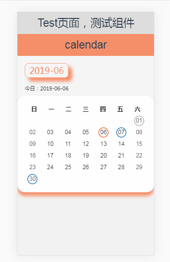
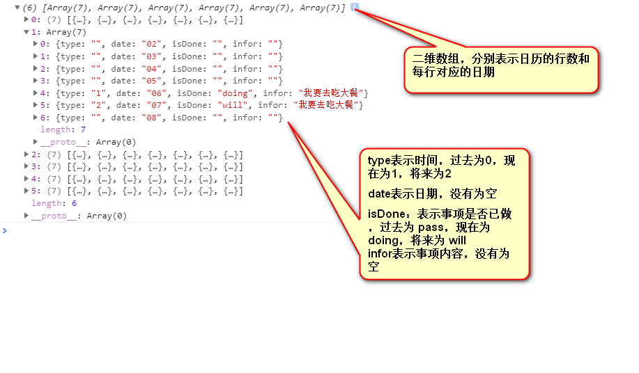

# 日历组件

## 效果

> 忙活了大概三天，做出来非常开心，心里美滋滋的
>
> 其实很早就想自己写一个日历组件了，只怪自己懒散
>
> 现在写一下思路过程，记录一下

  

## 需求

1、实现一个日历组件，如图：


2、显示某天的事项：


3、事项是模拟父组件请求接口返回的，数据格式如下：

```js
[
        {
          id: '232',
          date: '2019-06-01',
          info: '我要去吃大餐'
        },
        {
          id: '292',
          date: '2019-06-06',
          info: '我要去吃大餐'
        },
        {
          id: '292',
          date: '2019-06-07',
          info: '我要去吃大餐'
        },
        {
          id: '369',
          date: '2019-06-30',
          info: '我要去吃大餐'
        }
      ]
```

4、把事项添加到日历组件中，数据格式如下：



## 代码解析

**package.json文件：**

父组件页面：

```html
<template>
  <div class="test-container">
    <h1>Test页面，测试组件</h1>
    <!-- 日历 -->
    <calendar v-if="calendarVisible" @getDateInfo="getDateInfo" :propsInfoList="propsInfoList" :propsTime="propsTime"></calendar>
  </div>
</template>

<script>
import calendar from '@/components/Calendar/Calendar.vue'
export default {
  name: 'test',
  components: {
    "calendar": calendar
  },
  data() {
    return {
      calendarVisible: true,
      propsTime: '',
      propsInfoList: '',
      middle: [
        {
          id: '232',
          date: '2019-06-01',
          info: '我要去吃大餐'
        },
        {
          id: '292',
          date: '2019-06-06',
          info: '我要去吃大餐'
        },
        {
          id: '292',
          date: '2019-06-07',
          info: '我要去吃大餐'
        },
        {
          id: '369',
          date: '2019-06-30',
          info: '我要去吃大餐'
        }
      ]
    }
  },
  created() {
    // 模拟首屏ajax请求，将当月数据传入组件中
    this.propsInfoList = JSON.stringify(this.middle)
    this.propsTime = this.getToday()
  },
  mounted() {
    window.alert('测试时间为19年 5、6、7月，完成是在6月')
  },
  methods: {
    // 格式化当前日期 YYYY-MM-DD
    getToday() {
      let nowDate = new Date()
      let yy = nowDate.getFullYear().toString()
      let mm = (nowDate.getMonth() + 1 + '').padStart(2,'0')
      let dd = (nowDate.getDate() + '').padStart(2,'0')
      // let hh = nowDate.getHours().toString().padStart(2,'0')
      // let mt = (nowDate.getMinutes() + '').padStart(2,'0')
      // let ss = (nowDate.getSeconds() + '').padStart(2,'0')
      return `${yy}-${mm}-${dd}` // -${hh}-${mt}-${ss}
    },
    // 组件传值
    getDateInfo(year, month) {
      let _this = this
      _this.propsTime = `${year}-${month}`
      _this.calendarVisible = false
      // 模拟点击选取其他年月的ajax，假数据，只能显示19年 5 6 7三个月
      setTimeout(() => {
        _this.propsInfoList = []
        let middle
        if(month == '05') {
          middle  = [
            {
              id: '232',
              date: '2019-05-10',
              info: '我要去吃小餐'
            }
          ]
        } else if (month == '06') {
          middle = _this.middle
        } else if (month == '07') {
          middle  = [
            {
              id: '232',
              date: '2019-07-10',
              info: '我要去吃小餐'
            }
          ]
        } else {
          middle = ''
        }
        _this.propsInfoList = JSON.stringify(middle)
        _this.calendarVisible = true
      }, 100)
    }
  }
}
</script>

```


日历子组件：

```html
<template>
  <div class="calendar-container">
    // 日历标题
    <h1>calendar</h1>
    // 显示本月日期 2019-6，可点击
    <div class="show-date" @click="clickData">{{showDate}}</div>
    // 今天的日期 2019-6-6
    <div class="now-time">今日：{{exactTime}}</div>
    // 日历组件
    <div class="calendar">
    // 日历组件头部
      <ul class="calendar-header">
        <li>日</li>
        <li>一</li>
        <li>二</li>
        <li>三</li>
        <li>四</li>
        <li>五</li>
        <li>六</li>
      </ul>
    // 日历组件主体
      <ul class="calendar-body">
        <li class="calendar-row" v-for="(item, index) in JSON.parse(calendarData)" :key="index">
          // 注意给 不同的日子加类名
          // 周末：weekend  工作日：weekday
          // 过去的事项 already-time 今天的事项 exact-time 将来的事项 soon-time
          // 给有事项的日子实现点击弹框，显示这天的事项内容
          <span v-for="(subItem, subIndex) in item" :class="[subIndex == 0 || subIndex == 6? 'weekend': 'weekday', subItem.type == '1'? 'exact-time': '', subItem.type == '0'? 'already-time': '', subItem.type == '2'? 'soon-time': '']" @click="showInfo(subItem)" :key="subIndex">
            {{subItem.date}}
          </span>
        </li>
      </ul>
    </div>
    // popup 和 picker 搭配，实现 年月 选择   mint-ui 库
    <mt-popup v-model="popupVisible" position="bottom">
      <mt-picker :slots="slots" :showToolbar="true" :visibleItemCount="5" :itemHeight="itemsHeight" ref="picker">
        
        
      </mt-picker>
    </mt-popup>
  </div>
</template>

```

日历子组件逻辑：

```js
import { MessageBox } from 'mint-ui'
export default {
  name: "calendar",
  props: {
    propsTime: String,
    propsInfoList: String
  },
  data() {
    return {
      // 接收父组件传值 '2019-06'
      time: '',
      // 接收父组件数据列表
      infoList: '',
      // 日历组件
      calendarData: [],
      // 页面展示的 '年-月'
      showDate: '',
      // 当前的 '年-月-日'
      exactTime: '',
      // picker 高度
      itemsHeight: 95 * window.screen.height / 1334,
      // pupop 显示
      popupVisible: false,
      // picker 数据
      slots: []
    }
  },
  created() {
    // 拿到父组件的 list
    this.infoList = this.propsInfoList
    // 拿到父组件的 '2019-06'
    this.time = this.propsTime.split('-')
    // 获取今天 '2019-06-06'
    const date = this.getToday()
    this.exactTime = date.slice(0,3).join('-')
    // 日历组件
    this.getCalendar(...(this.time))
    // 组装 picker 数组
    this.getSlotsArray(...(date.slice(0,2)))
  },
  methods: {
    // 日历组件
    getCalendar(year, month) {
      let _this = this
      // 转存当天 '2019-06-06'
      const rightNow = _this.exactTime
      // 拼接 显示日历上的年月 '2019-05'
      _this.showDate = `${year}-${month}`
      // 获取当月的第一天
      const firstDate = new Date(year, month - 1, 1)
      // 获取第一天周几
      const firstDay = firstDate.getDay()
      // 判断是否为闰年
      const isLeapYear = year % 100 == 0? year % 400 == 0? 1: 0: year % 4 == 0 ? 1: 0
      // 获取今年每个月的天数
      const monthArray = [31, 28 + isLeapYear, 31, 30, 31, 30, 31, 31, 30, 31, 30, 31]
      // 计算星期的行数
      const weeekLines =Math.ceil((monthArray[month - 1] + firstDay)/7)
      let calendar = []
      for(let i = 0; i < weeekLines; i++) {
        let weeekLinesInfo = []
        for(let j = 0; j < 7; j++) {
          // 计算每个单元格的序号
          const cellNo = i * 7 + j
          // 计算每个单元格应该填充的日期
          const datePerLine = cellNo - firstDay + 1
          // 排除空白格
          if(datePerLine <= 0 || datePerLine > monthArray[month - 1]) {
            // 不存在的显示为 null 和 ''
            let outOfMonth = {
              "type" : 'null',
              "date" : ''
            }
            weeekLinesInfo[j] = outOfMonth
          } else {
            let day = (datePerLine + '').padStart(2,'0')
            let inOfMonth = {
              "type" : '',
              "date" : day,
              "isDone": '',
              "infor": ''
            }
            // 今天背景变成一个红圈,这是今天 => rightNow
            const propsDate = `${year}-${month}-${day}`
            // 比较每月的今天
            if(propsDate == rightNow){
              inOfMonth.type = "1"
            }
            const reservations = JSON.parse(_this.infoList)
            // 将 父组件传的 list 赋值在日历上
            // 预定列表 和 当月每一天比较
            for(let k = 0; k < reservations.length; k++) {
              if(propsDate == reservations[k].date){
                // inOfMonth.type = "1"
                inOfMonth.infor = reservations[k].info
                if(rightNow == reservations[k].date) {
                  inOfMonth.type = "1"
                  inOfMonth.isDone = "doing"
                } else if (rightNow > reservations[k].date) {
                  inOfMonth.type = "0"
                  inOfMonth.isDone = "pass"
                } else if (rightNow < reservations[k].date) {
                  inOfMonth.type = "2"
                  inOfMonth.isDone = "will"
                }
              }
            }
            weeekLinesInfo[j] = inOfMonth
          }
        }
        calendar.push(weeekLinesInfo)
      }
      window.console.log(calendar)
      // 即将遍历二维数组
      _this.calendarData = JSON.stringify(calendar)
    },
    // 格式化当前日期 YYYY-MM-DD
    getToday() {
      let nowDate = new Date()
      let yy = nowDate.getFullYear().toString()
      let mm = (nowDate.getMonth() + 1 + '').padStart(2,'0')
      let dd = (nowDate.getDate() + '').padStart(2,'0')
      let hh = nowDate.getHours().toString().padStart(2,'0')
      let mt = (nowDate.getMinutes() + '').padStart(2,'0')
      let ss = (nowDate.getSeconds() + '').padStart(2,'0')
      return [yy, mm, dd, hh, mt, ss]
      // return `${yy}-${mm}-${dd}-${hh}-${mt}-${ss}`
    },
    // 组装 picker 数组
    getSlotsArray(year, month){
      let _this = this
      let yearArray = []
      for(let i = -10 ; i <= 10 ; i ++){
        yearArray.push(year - 1 + i)
      }
      let monthArray = [1, 2, 3, 4, 5, 6, 7, 8, 9, 10, 11, 12]
      let slots = [
        {
          values:yearArray,
          className:"slot1",
          defaultIndex: 11
        },
        {
          values:monthArray,
          className:"slot2",
          defaultIndex:month - 1
        }
      ]
      _this.slots = slots
    },
    // 显示日期弹窗
    clickData(){
      this.popupVisible = true
    },
    // 取消按钮
    cancelFunc(){
      this.popupVisible = false;
    },
    // 确认按钮
    sureFunc() {
      let _this = this
      _this.popupVisible = false
      const clickData = _this.$refs.picker.getValues()
      const year = clickData[0] + ''
      const month = (clickData[1] + '').padStart(2,'0')
      const day = _this.time[2]
      _this.getDateInfo(year, month)
      _this.getCalendar(year, month)
    },
    // 调用父组件定义的方法
    getDateInfo(year, month) {
      this.$emit('getDateInfo', year, month)
    },
    // 点击展示某天的事项信息
    showInfo(info) {
      let _this = this
      const infor = info
      if(infor.infor) {
        const [year, month] = _this.showDate.split('-')
        console.log(year, month, info)
        const titleDate = `${year}-${month}-${info.date}`
        const preview = info.infor
        MessageBox({
          title: titleDate,
          message: preview,
          showCancelButton: false,
          closeOnClickModal: true
        })
      }
    }
  }
}

```

其他：为了减少篇幅，省略样式

[github地址](https://github.com/houfeii)
